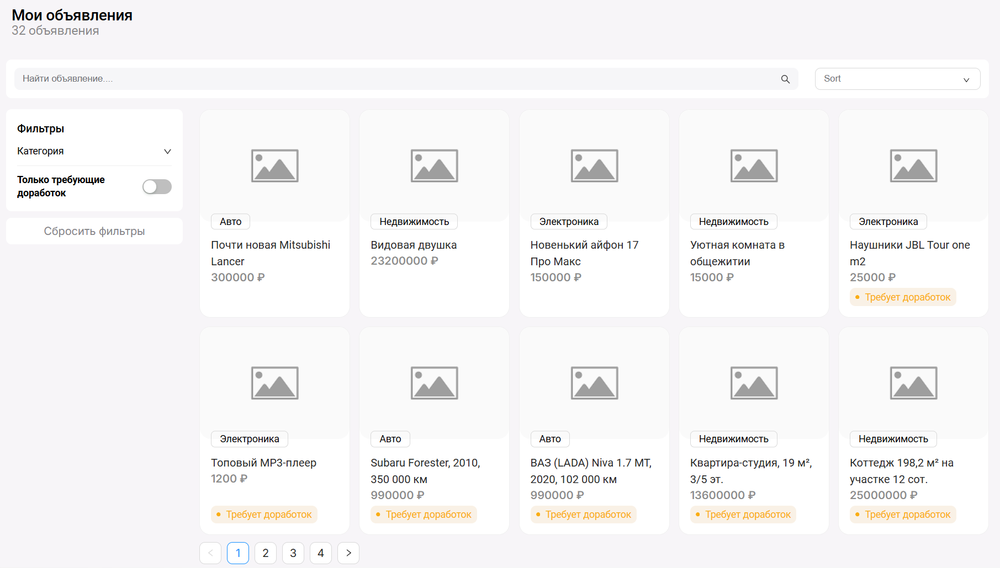
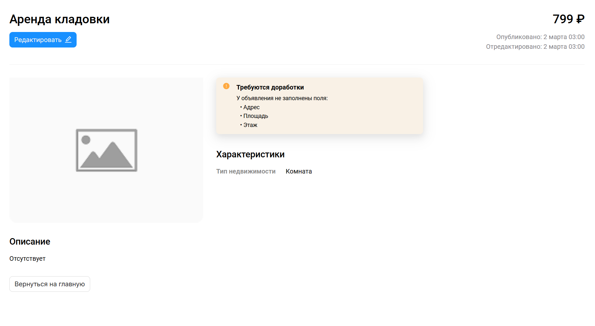
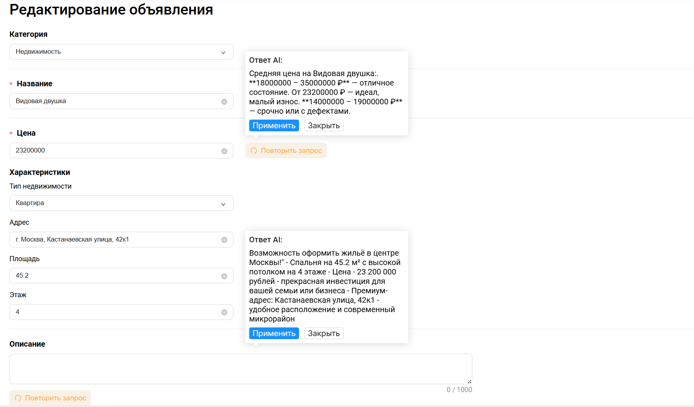

# AI-Seller — Умный помощник для продавцов

> **AI-ассистент, который помогает создавать идеальные описания товаров и определять рыночную цену**

## О проекте

**AI-Seller** — это веб-приложение для продавцов, которое помогает управлять объявлениями и улучшать их с помощью искусственного интеллекта.

### Возможности

| Функция | Описание |
|---------|----------|
| **Управление объявлениями** | Просмотр, редактирование, фильтрация и поиск |
| **AI-генерация описаний** | Автоматическое создание привлекательных текстов через Ollama |
| **Анализ рыночной цены** | Определение оптимальной цены на основе характеристик |
| **Черновики** | Автосохранение в localStorage |
| **Docker поддержка** | Лёгкий запуск одной командой |

### Технологии

**Фронтенд**
- React 19 + TypeScript
- Vite (сборка)
- React Router (навигация)
- TanStack Query (кэширование)
- Zod (валидация)
- SCSS Modules (стили)

**Бекенд**
- Fastify (сервер)
- Ollama (локальный AI)

## Быстрый старт

### Предварительные требования

- Node.js 18+
- Docker (опционально)

### Запуск без Docker

```bash
# 1. Клонируем репозиторий
git clone https://github.com/ArFaris/AI-Seller.git
cd AI-Seller

# 2. Запускаем бекенд
cd server
npm install
npm start

# 3. В новом терминале запускаем фронтенд
cd client
yarn install
yarn dev

Откройте http://localhost:5173
```

### Запуск с Docker (рекомендуется)

```bash

docker compose up --build

```

### Приложение будет доступно:

- *Фронтенд*: http://localhost:5173
- *API*: http://localhost:8080

## AI-функции

Для подключения AI через *Ollama*:

```bash

# 1. Установите Ollama
# Скачайте с https://ollama.com/download

# 2. Скачайте модель
ollama pull mistral

```
<details>
<summary>Структура проекта (нажмите, чтобы развернуть)</summary>

```bash

AI-Seller/
├── client/ # React + TypeScript
│ ├── src/
│ │ ├── App/pages/ # Страницы приложения
│ │ ├── components/ # UI компоненты
│ │ ├── hooks/ # React Query хуки
│ │ ├── services/ # LLM сервисы
│ │ ├── shared/schemas/ # Zod валидация
│ │ ├── types/ # TypeScript типы
│ │ └── utils/ # Вспомогательные функции
│ └── package.json
│
├── server/ # Fastify API
│ ├── data/ # JSON база данных
│ ├── server.ts # Точка входа
│ └── package.json
│
└── docker-compose.yml # Docker

```
</details>

## Основные страницы

| Страница | Роут | Описание |
|----------|------|----------|
| Список объявлений | `/ads` | Карточки товаров с фильтрацией и пагинацией |
| Просмотр | `/ads/:id` | Полная информация о товаре |
| Редактирование | `/ads/:id/edit` | Форма с AI-помощником |

## Принятые решения

### Отказ от UI-библиотеки

- **Точное соответствие** макетам Figma
- **Полный контроль** над стилями
- **Минимальный** размер бандла
- **Отсутствие лишних** зависимостей

### Выбор Ollama

- **Бесплатная** локальная работа
- **Не требует** API-ключей
- **Работает** офлайн
- **Конфиденциальность** данных

### Управление состоянием: выбор React Query

Вместо классических стейт-менеджеров (MobX, Redux) выбран **React Query**, потому что:

- **Серверное состояние** — основная масса данных в приложении приходит с API
- **Кэширование** — данные не перезапрашиваются при каждом переходе
- **Автоматическая ревалидация** — список обновляется после сохранения
- **Меньше кода** — не нужно писать сторы, экшены и редьюсеры
- **Оптимистичные обновления** — интерфейс реагирует мгновенно

MobX и Redux лучше подходят для сложного **клиентского состояния** (UI-состояния, формы, корзина), но в данном проекте эти задачи решаются через `useState` и кастомный хук `useForm`.

### Архитектура

- **Страницы** изолированы в `App/pages/`
- **Общие компоненты**, хуки и утилиты вынесены в отдельные папки
- **React Query** для управления серверным состоянием
- **Zod** для валидации форм
- **Кастомный хук useForm** для управления формой

## Скриншоты

| Список объявлений | Просмотр товара | Редактирование с AI |
|:-----------------:|:---------------:|:-------------------:|
|  |  |  |
| Фильтрация, поиск, пагинация | Детальная информация | AI-генерация описания и цены |

👤 Автор
[Arina Fariseeva]
